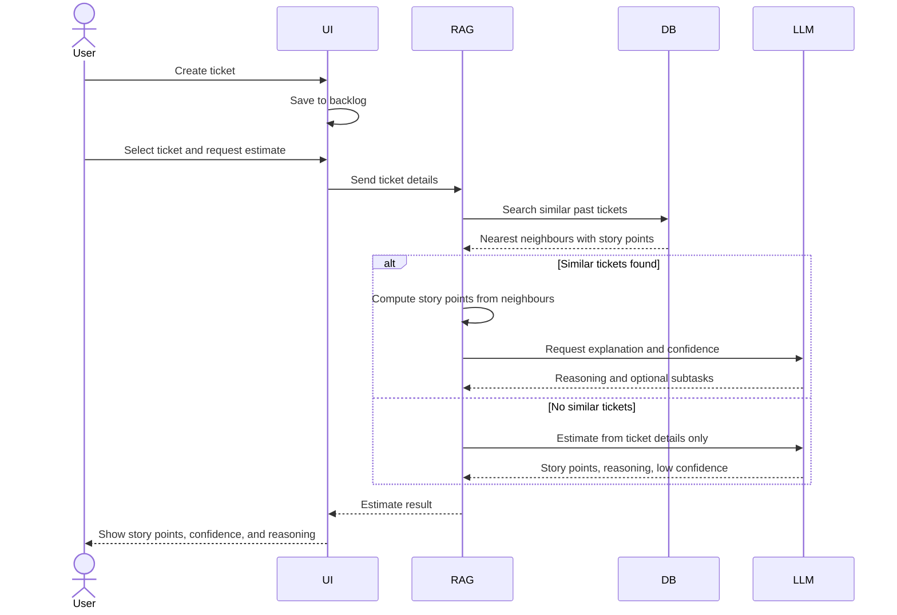
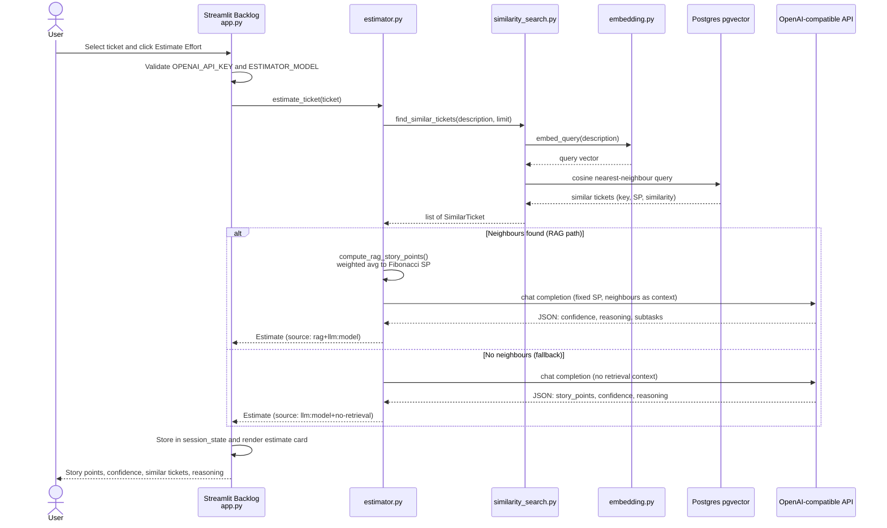

# Effort Estimator - CA2 Prototype

A Jira-styled Streamlit prototype that uses an LLM to estimate story points,
confidence, and (when needed) a subtask decomposition for software tickets.
Users create their own backlog tickets and run AI-assisted estimation on them.

## Setup

```powershell
cd ca2-effort-estimator
python -m venv .venv
.\.venv\Scripts\Activate.ps1
pip install -r requirements.txt
copy .env.example .env   # then fill in OPENAI_API_KEY if you have one
streamlit run app.py
```

The app runs without an API key - it falls back to a deterministic heuristic
estimator so the UI is fully demoable offline.

## Layout

- `app.py` - Backlog page (ticket dropdown, estimate detail)
- `pages/Ticket.py` - Ticket creation form (Title, Project, Task Type, Description)
- `pages/About.py` - About page (aim, technology stack, data/training statement)
- `ui/theme.py` - Shared CSS theme, header, and header navigation links
- `ui/components.py` - Shared UI helpers (pills, estimate card rendering)
- `tickets/store.py` - Load/save user tickets to `data/user_tickets.json`
- `estimator.py` - LLM call + offline heuristic fallback
- `data/user_tickets.json` - user-created backlog (starts empty)
- `data/tawos_sample.csv` - legacy sample data (used by scripts/embeddings, not the app backlog)
- `data/tawos_with_story_points.csv` - full export of tickets with positive story points
- `data/tawos_balanced_train.csv` - balanced ~20% training subset (Fibonacci labels)
- `data/tawos_balanced_train_with_zero.csv` - balanced ~20% training subset including zero-point tickets
- `scripts/analyze_tawos.py` - CLI summary stats for the full TAWOS MySQL dataset
- `scripts/export_tawos_training_data.py` - export training CSVs from MySQL
- `scripts/create_train_retrieval_split.py` - 80/20 retrieval corpus vs training holdout split
- `scripts/generate_embeddings.py` - embed retrieval corpus into Postgres pgvector
- `scripts/similarity_search.py` - shared pgvector nearest-neighbour lookup
- `mcp/tawos_similarity_server.py` - MCP tool for nearest-neighbour ticket search
- `docker-compose.yml` - Postgres + pgvector for vector retrieval
- `notebooks/tawos_dataset_analysis.ipynb` - Interactive tables and charts for TAWOS dataset analytics

## Pages

The app has three pages: **Ticket** (create backlog items), **Backlog** (select a
ticket and run the estimator), and **About** (project documentation). Navigate
via the header links at the top of each page; the Streamlit sidebar is hidden.

### Workflow

1. Open the **Ticket** tab and fill in Title, Project Name, Task Type (Story, Bug, Task, Epic, Improvement, and other common TAWOS types), and Description.
2. Submit to add the ticket to `data/user_tickets.json` (persists across refreshes).
3. Switch to **Backlog**, pick the ticket from the dropdown, and click **Estimate Effort**.

## Architecture

### High-level workflow

At a high level, the user interacts with the **UI** (Streamlit), which delegates
estimation to the **RAG** pipeline. RAG queries the vector **DB** for similar TAWOS
tickets, computes story points when neighbours exist, and calls the **LLM** for
explanation. The detailed file-level sequence follows below.



### Estimation sequence (detailed)

When a user clicks **Estimate Effort** on the Backlog page, the app runs a RAG-first
estimation pipeline: embed the ticket description, retrieve similar TAWOS tickets from
Postgres, compute story points deterministically, then ask the LLM to explain the result.

Story points are **not** LLM-generated when retrieval succeeds — they are computed in
`compute_rag_story_points()` from neighbour similarities and snapped to the Fibonacci
scale. The LLM explains the fixed estimate, sets confidence (capped by RAG confidence),
and optionally decomposes into subtasks. Estimates are stored in session state only
(not persisted to disk).



**RAG path:** neighbours found → weighted average of neighbour story points snapped to
Fibonacci → LLM explains with fixed SP (`rag+llm:{model}`).

**Fallback:** no neighbours (empty description, Postgres down, or no embeddings) →
LLM estimates SP from ticket details only, with capped confidence and a UI warning
(`llm:{model}+no-retrieval`).

## Swapping the model provider

Set `OPENAI_BASE_URL` in `.env` to point at any OpenAI-compatible endpoint
(local Ollama, Together, Groq, etc.) and `ESTIMATOR_MODEL` to the model id.

## TAWOS dataset (scripts and retrieval only)

The Streamlit app no longer loads a prebuilt CSV backlog. TAWOS data files remain
for dataset analytics, training exports, and vector similarity retrieval during
estimation.

```bash
mysql tawos < TAWOS.sql
python scripts/export_tawos_training_data.py
```

This writes three files into `data/`:

| File                                 | Contents                                                        |
| ------------------------------------ | --------------------------------------------------------------- |
| `tawos_with_story_points.csv`        | All tickets with story points > 0 and ≤ 100                     |
| `tawos_balanced_train.csv`           | ~20% balanced subset mapped to Fibonacci scale (higher bracket) |
| `tawos_balanced_train_with_zero.csv` | Same balanced sampling, but includes zero-point tickets         |

Story points are mapped to the Fibonacci scale (`1, 2, 3, 5, 8, 13, 21`).
Exact matches are kept; values strictly between two scale points map to the
**higher** bracket (e.g. `10 → 13`, `4 → 5`). Zero-point tickets are labelled `0`.
Exported `title` and `description` fields have TAWOS literal quote wrappers stripped.

Point exported CSVs at scripts or embeddings workflows as needed. The app backlog
is managed entirely through the Ticket page and `data/user_tickets.json`.

## Dataset analytics

Explore summary statistics for the full TAWOS `Issue` table in MySQL.

**Prerequisite:** MySQL running with the `tawos` database loaded:

```bash
mysql tawos < TAWOS.sql
```

Install dependencies (if not already done), then run either the CLI or the notebook:

```bash
pip install -r requirements.txt
python scripts/analyze_tawos.py
jupyter lab notebooks/tawos_dataset_analysis.ipynb
```

The script prints ticket counts, missing-field stats, description length
summaries, priority/story-point distributions, and a per-project breakdown.
The notebook presents the same metrics as tables and seaborn charts, including
story point class imbalance and per-project story-point distribution for the
top projects. Override the connection string in `.env` with `DATABASE_URL` if
your MySQL host or credentials differ (see `.env.example`).

## Vector similarity retrieval (Postgres + MCP)

MySQL remains the TAWOS source of truth. Postgres with pgvector stores embedded
ticket descriptions for nearest-neighbour retrieval during estimation or analysis.

### Prerequisites

Requires **Python 3.10+** for the MCP server (`fastmcp`). Other scripts in this
section work on Python 3.9+.

```bash
pip install -r requirements.txt
docker compose up -d
mysql tawos < TAWOS.sql
```

Copy `.env.example` to `.env` and adjust `POSTGRES_URL` / `EMBEDDING_*` if needed.
Local embeddings (`EMBEDDING_PROVIDER=local`) work offline; set
`EMBEDDING_PROVIDER=openai` to use an OpenAI-compatible embedding endpoint.

### 1. Create the 80/20 split

Eligible tickets must have a non-empty description and a non-negative story-point label
(including zero). The retrieval corpus (80%) is embedded; the training holdout
(20%) is reserved for model training/eval and is not embedded by default.

```bash
python scripts/create_train_retrieval_split.py
```

Outputs:

| File                              | Contents             |
| --------------------------------- | -------------------- |
| `data/tawos_retrieval_corpus.csv` | 80% retrieval corpus |
| `data/tawos_train_holdout.csv`    | 20% training holdout |

### 2. Embed the retrieval corpus

```bash
python scripts/generate_embeddings.py
```

Use `--limit 100` for a quick smoke test. Use `--force` to re-embed rows for the
current `EMBEDDING_MODEL`.

### 3. MCP similarity search

Register the server in Cursor via `.cursor/mcp.json`, then use the
`find_similar_tickets` tool. It embeds a query description and returns the
closest tickets with `description`, `story_points`, and `similarity`.

Run manually:

```bash
python mcp/tawos_similarity_server.py
```

### 4. Streamlit estimator with vector retrieval

The backlog estimator (`streamlit run app.py`) uses a **RAG-first** flow when you
click **Estimate Effort**:

1. Embeds the ticket description and fetches the nearest neighbours from Postgres
   (configurable via `SIMILAR_TICKETS_LIMIT`)
2. **Computes story points** from a similarity-weighted average of neighbour SPs,
   snapped to the Fibonacci scale
3. Sends neighbours + fixed SP to the LLM for **reasoning**, confidence, and
   optional subtask decomposition
4. Displays **Similar past tickets** and a RAG baseline line in the estimate card

If no neighbours are found, the LLM estimates story points from ticket details
only, with **low confidence** and an explicit warning.

**Requirements:**

- `OPENAI_API_KEY` and `ESTIMATOR_MODEL` set in `.env` (e.g. Olmo via LM Studio)
- Postgres running with embeddings ingested (`generate_embeddings.py`)

**Validation:**

1. Run `streamlit run app.py`
2. Create a ticket and click **Estimate Effort**
3. Confirm **Similar past tickets** appears and Source shows `rag+llm:{model}`
4. Confirm the estimate card shows the RAG baseline line (weighted avg → SP)
5. With Postgres down or empty description, confirm low-confidence fallback
   and warning when Source shows `+no-retrieval`
